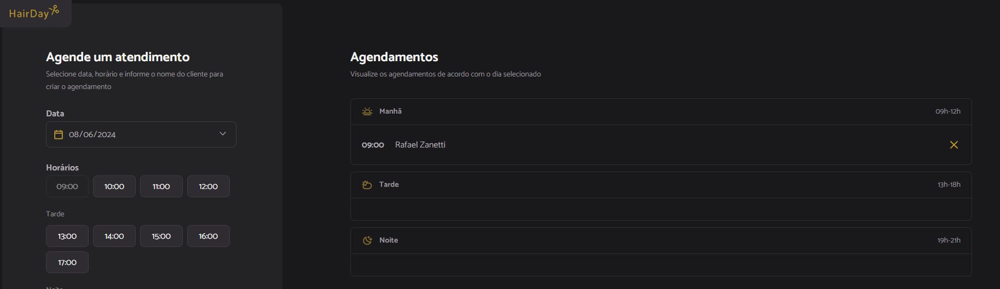

## HairDay

---

Aplicação desenvolvida durante o MBA da Rocketseat, utilizando de JS, HTML e CSS.
Utilizando do Babel para maior compatibilidade do JS e o Webpack para bundling.
Para dependências externas, utilizamos do NPM para gerenciar os pacotes e suas versões.

#### 🛠️ Tecnologias

 Webpack: https://webpack.js.org

 Babel: https://babeljs.io

---

### 🎲 Executando

Após clonar o repositório, acesse o diretório, instale as dependências:

```bash
$ npm i
```

Depois, pode executar os seguintes comandos em terminais separados para iniciar o projeto:

Executar **json-server**:
```bash
$ npm run server
```

Executar a aplicação:
```bash
$ npm run dev
```